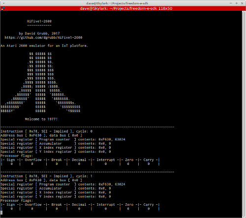
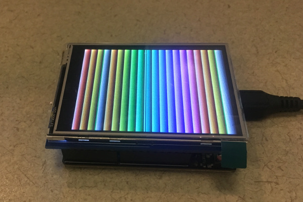

# HiFive1-2600

This project is an embedded cycle-accurate simulation of a MOS 6502 (technically, 6507)
processor. Also included in the simulation is the memory map of an Atari 2600 
video game console.

[Hold onto your butts ...](https://www.youtube.com/watch?v=HKK4KmDlj8U)

## Preview





## Hardware

This project targets the [SiFive HiFive1](https://www.sifive.com/products/hifive1/) 
development board paired with a 2.8" TFT [touchscreen from Adafruit](https://www.adafruit.com/product/1651).

## Usage

Checkout the [freedom-e-sdk](https://github.com/sifive/freedom-e-sdk) and clone 
this repository directly into the *software* directory. Proceed to compile and 
upload as with any other freedom-e-sdk program:

```
 $ make software PROGRAM=HiFive1-2600 BOARD=freedom-e300-hifive1
 $ make upload PROGRAM=HiFive1-2600 BOARD=freedom-e300-hifive1
```

Optionally, ensure that the flag -DEXEC_TESTS is set in the Makefile to run the 
unit test suites which will load test programs into the emulator and will verify 
the correct functioning of the simulator.

-DMANUAL_STEP disables automatic clocking and executes a clock cycle with each 
press of the spacebar. Useful for step-by-step debugging.
